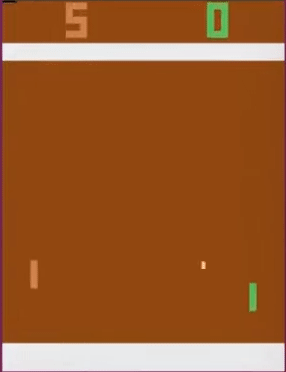

# Deep-Q-Network-with-OpenAI
[](https://gym.openai.com/)


  General Discription:
---
This project utilizes deep Q-Learning to play the Atari game: 'PongNoFrameskip-v4' from `OpenAI` gym. The project is inspired by `Playing Atari with Deep Reinforcement Learning` from `DeepMind` team in `Google`.  

Test on Ubuntu 14.04 with NVIDIA TESLA V100  


To replicate the experiment results, a number of dependencies need to be installed, namely:  
- Python 3.5
- Torch 1.5.1
- OpenAI Gym
- Numpy 

It took me about 10 hours to train the network with 8 cpu, a NVIDIA TESLA V100, and 60 GB Memory(make sure you have at least 40GB mem or the program may crash).Therefore, I highly recomand you to use `monitor` and cloud platforms to run the code, e.g. Google Cloud Platform(Which I used).  

Run 
---
```#Bash
nohup python3 DQN_Pong.py
```
