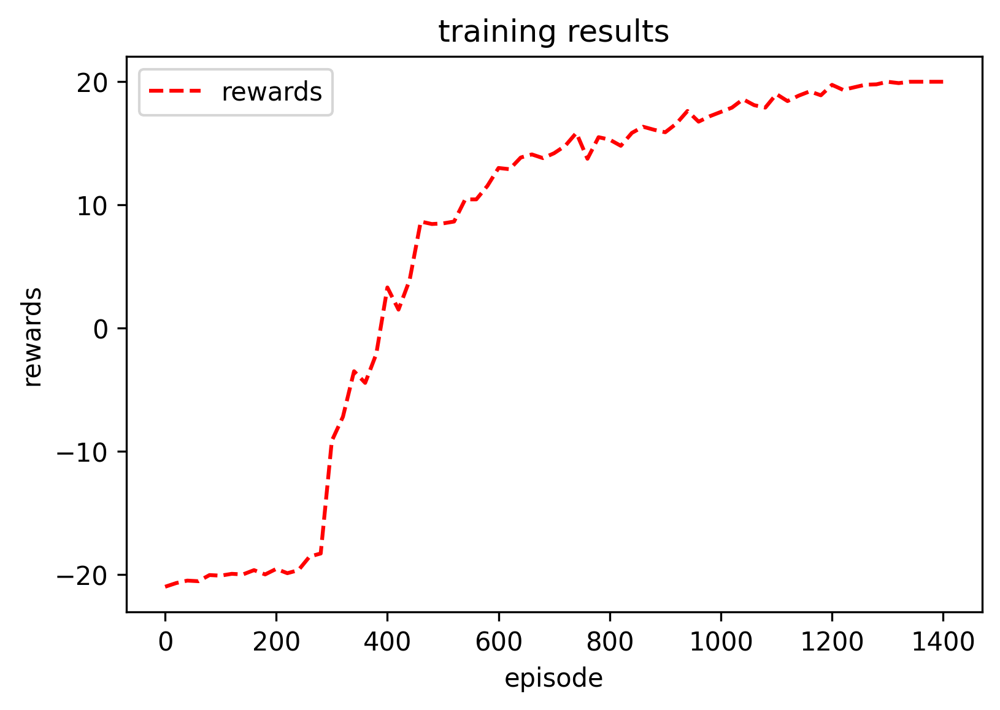
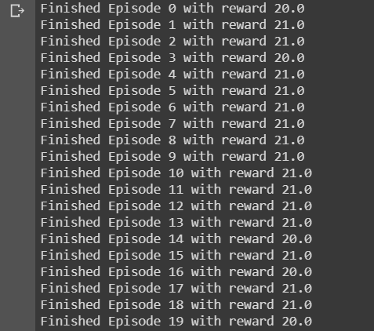
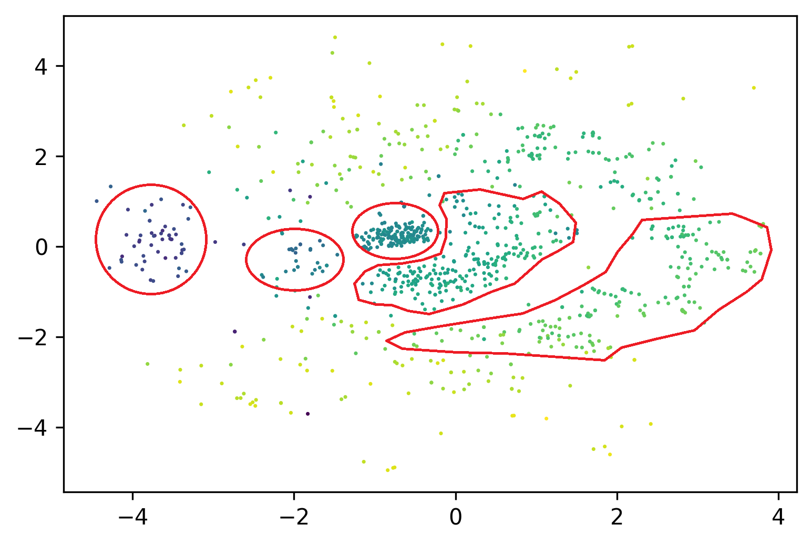

# Deep Q Network with OpenAI
[](https://gym.openai.com/)


  General Discription:
---
This project utilizes deep Q-Learning to play the Atari game: 'PongNoFrameskip-v4' from `OpenAI` gym. The project is inspired by `Playing Atari with Deep Reinforcement Learning` from `DeepMind` team in `Google`.  

Test on Ubuntu 14.04 with NVIDIA TESLA V100  


To replicate the experiment results, a number of dependencies need to be installed, namely:  
- Python 3.5
- Torch 1.5.1
- OpenAI gym
- Numpy 

It took me about 10 hours to train the network with 8 vCPU, a NVIDIA TESLA V100, and 30 GB Memory(make sure you have at least 16GB mem or the program may crash).Therefore, I highly recomand you to use `monitor` and cloud platforms to run the code, e.g. Google Cloud Platform(Which I used).  

Run 
---
```#Bash
$ nohup python3 DQN_Pong.py
```
According to the DQN code, in the end(After a long training time), you will have a file `nohup.out`, a png image `go.png`, and a pth file `checkpoint1.pth`.  

1. nohup.out  
This file stores the training log and the reason I used nohup to run the program is that I can close SSH and check it out after 10 hrs. You can read it by:
```#Bash
$ cat nohup.out
```
2. go.png  
This image just shows the rewards at the corresponding time  
  
and you can tell that, in the end, trained DQN wins every time.  
3. checkpoint1.pth  
This file just stores the weights of the neural network and it can be used easily by Pytorch later.  
```//python
test_model.load_state_dict(torch.load("checkpoint1.pth"))
```

Test Phase
---
Run `test_code.py` and you will soonly receive the results. We set the AI to play 20 games and it won all of them.  


Visualize and Analyze Trained DQN
---
A core challenge with DL is understanding or explaining how they make decisions. This generally
area known as XAI is an active research area but here your aim is to gain some level of insight into
how your DL is making decisions.  
I applied some dimension reduction techniques to this model and visualized the structure of those frames/activations by mapping
them to a 2-D space.

`Multidimensional scaling (MDS)` seeks a low-dimensional representation of the data in which the distances respect well the distances in the original high-dimensional space.

In general, MDS is a technique used for analyzing similarity or dissimilarity data. It attempts to model similarity or dissimilarity data as distances in a geometric spaces. The data can be ratings of similarity between objects, interaction frequencies of molecules, or trade indices between countries.

There exists two types of MDS algorithm: metric and non metric. In the scikit-learn, the class MDS implements both. In Metric MDS, the input similarity matrix arises from a metric (and thus respects the triangular inequality), the distances between output two points are then set to be as close as possible to the similarity or dissimilarity data. In the non-metric version, the algorithms will try to preserve the order of the distances, and hence seek for a monotonic relationship between the distances in the embedded space and the similarities/dissimilarities.



References
---
1. Mnih, V., Kavukcuoglu, K., Silver, D., Graves, A., Antonoglou, I., Wierstra, D., & Riedmiller, M. (2013). Playing Atari with Deep Reinforcement Learning.
2. Paper, D. (2020). Hands-on Scikit-Learn for machine learning applications : Data science fundamentals with Python (1st ed. 2020. ed.).
3. https://scikit-learn.org/stable/modules/manifold.html
4. Paszke, A. (2017). Reinforcement Learning (DQN) Tutorial¶. Retrieved July 02, 2020, from https://pytorch.org/tutorials/intermediate/reinforcement_q_learning.html
5. Van der Maaten, L.J.P., & Hinton, G.E. (2008). Visualizing High-Dimensional Data Using t-SNE. Journal of Machine Learning Research, 9(Nov), 2579-2605.
